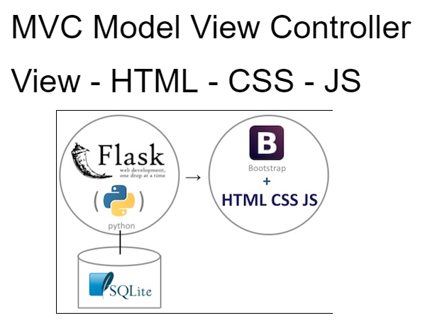

# MVC with Flask

Stands for "Model-View-Controller." MVC is an application design model comprised of three interconnected parts. They include the model (data), the view (user interface), and the controller (processes that handle input).

The MVC model or "pattern" is commonly used for developing modern user interfaces. It is provides the fundamental pieces for designing a programs for desktop or mobile, as well as web applications. It works well with object-oriented programming, since the different models, views, and controllers can be treated as objects and reused within an application.

A description of each aspect of MVC:

__1. Model:__

A model is data used by a program. This may be a database, file, or a simple object.

__2. View:__

A view is the means of displaying objects within an application. Examples include displaying a window or buttons or text within a window. It includes anything that the user can see.

__3. Controller:__

A controller updates both models and views. It accepts input and performs the corresponding update. For example, a controller can update a model by changing the attributes of a character in a video game. It may modify the view by displaying the updated character in the game.

The three parts of MVC are interconnected:



The view displays the model for the user. The controller accepts user input and updates the model and view accordingly.

How it works:

1. A user requests to view a page by entering a URL.
2. The Controller receives that request.
3. It uses the Models to retrieve all of the necessary data, organizes it, and sends it off to the…
4. View, which then uses that data to render the final webpage presented to the user in their browser.

In this program we are going to use __Flask__ as a controller. There are more options such as Django.

- install flask:
`pip install flask`

- to run and open webpage to see the view:
`flask run`
  
- Create a file called `app.py`
  
- Create a folder called `templates` to keep any HTML files in there for the view.

- Import Flask and create "app" as object of Flask

- Create pages with `@app.route("/name/")`

- Link files to certain addresses on the port with

````python
@app.route("/home/")
def home():
    return render_template("index.html")
````
- Add routes (website addresses)

- Add functions (one per webpage)

- A template file can be created in order to reuse the same header on multiple pages.

Inheritance with Flask:

- Parent file has `` or `` -> Block is used to overwrite HTML within the block.
  
- Child uses `` with the same `` -> This is used to add to the parent HTML file.

- When child.html is used, it is added to parent and both are shown.
